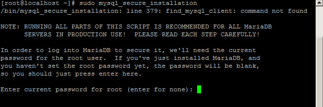
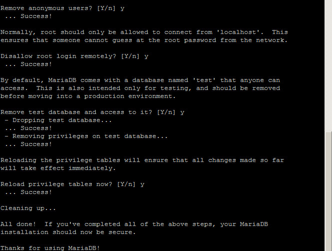

--------------------------------
Install MariaDB on CentOS
--------------------------------

`MariaDB <https://mariadb.org/>`_ server is a community developed fork of **MySQL** server. Started by core members of the original MySQL team, **MariaDB** is designed as a drop-in replacement of **MySQL(R)** with more features, new storage engines, fewer bugs, and better performance.

**MariaDB** can be an better choice for choice for database professionals looking for a robust, scalable, and reliable SQL server.

In this tutorial, we will explain how to install the latest version of **MariaDB** on a **CentOS 7**.

The procedure to install MariaDB on an CentOS Linux 7 is as follows:

Step 1 - Add MariaDB Yum Repository
-----------------------------------------------

Create a new repo file ``/etc/yum.repos.d/mariadb.repo`` and add the below code changing the base url according to the operating system version and architecture.

.. code-block:: text
    :linenos:

    [mariadb]
    name = MariaDB
    baseurl = http://yum.mariadb.org/10.3/centos73-amd64/
    gpgkey=https://yum.mariadb.org/RPM-GPG-KEY-MariaDB
    gpgcheck=1

Step 2 - Install MariaDB Server
-----------------------------------------------

After the file is in place, install MariaDB with:

.. code-block:: shell
    :linenos:

    sudo yum install MariaDB-server MariaDB-client -y

Once the installation is complete, we'll enable and start the daemon with the following commands:

.. code-block:: shell
    :linenos:

    sudo systemctl enable mariadb # run at server boot time

    sudo systemctl start mariadb # Start MariaDB command

    sudo systemctl stop mariadb # Stop MariaDB command

    sudo systemctl restart mariadb # Restart MariaDB command

    sudo systemctl status mariadb # Find status of MariaDB server command

Step 3 - Secure MariaDB Install
-----------------------------------------------

**MariaDB** includes a security script “**mysql_secure_installation**”, to change some of the less secure default options. For things like removing remote root logins and sample and Anonymous users.

In this tutorial, im gonna explain how to secure mariadb with mysql_secure_installation on Redhat/CentOS 7

Next step is to set a password for the user root and some others things to make your mariadb more secure.

Step 4 - Working with MariaDB
-----------------------------------------------

Once the configuration is complete, connect to MariaDB server using the following command.

.. code-block:: shell
    :linenos:

    # mysql -u root -p

    Welcome to the MariaDB monitor. Commands end with ; or \g.
    Your MariaDB connection id is 16
    Server version: 10.3.2-MariaDB MariaDB Server

    Copyright (c) 2000, 2017, Oracle, MariaDB Corporation Ab and others.

    Type 'help;' or '\h' for help. Type '\c' to clear the current input statement.

    MariaDB [(none)]>

Let’s create a new database.

.. code-block:: shell
    :linenos:

    create database TestDB character set utf8mb4 collate utf8mb4_unicode_ci;

Create a database user account and Grant permissions.

.. code-block:: shell
    :linenos:

    grant all privileges on TestDB.* to 'TestUser'@'%' identified by 'TestPassw' with grant option;

Once you have grant the permissions that you want to set up for your new users, make sure to reload all the privileges using the following command:

.. code-block:: shell
    :linenos:

    flush privileges;

**Reference:**

- `How To Install MariaDB 10.3 On CentOS 7 <http://yallalabs.com/linux/how-to-install-mariadb-10-3-on-centosrhel-7/>`_
